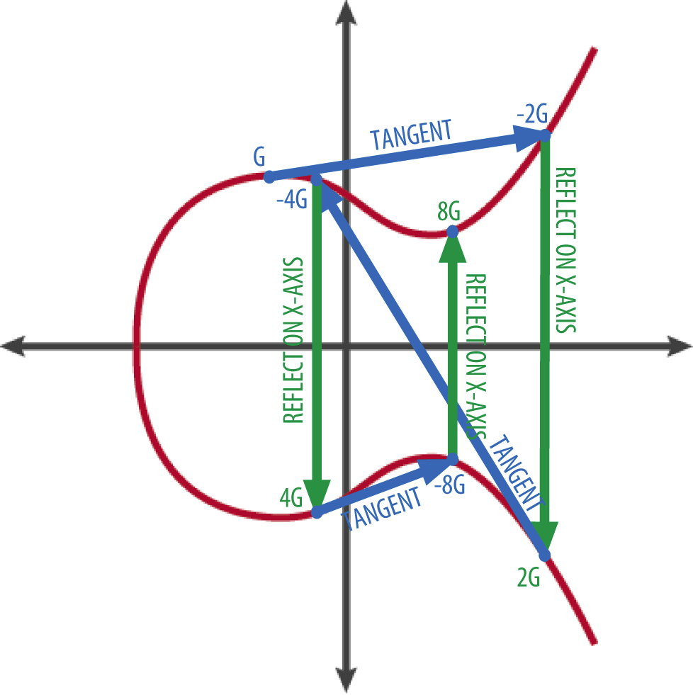

<!-- .slide: data-background-color="#8D3AED" -->

## Cryptography

---

### Asymmetric cryptography

Elliptic Curve Cryptography protocol is used in Cosmos SDK.

Cosmos SDK provides 3 digital signature algorithms for creating digital signatures:

- secp256k1: use by accounts
- secp256r1: use by accounts
  (for supporting signing algorithm on secure enclave in macOS/iOS/watchOS and Android Hardware-backed Keystore)
- Ed25519: Only used for Consensus validation on Tendermint side

We can see that user accounts and consensus validator accounts don't use the same digital signature algorithm.

---

### Public key compressed format for secp256k1 & secp256r1 I

secp256k1 elliptic curve with formula: `y^2 = x^3 + 7`.



---

### Public key compressed format for secp256k1 & secp256r1 II

A public key is just a point on the elliptic curve secp256k1.

The `G point` is added to himself a secret number of times (the `private key`) to finally land on a point on the curve which is the `public key`.

As an y-coordinate can be calculated easily from an x-coordinate following the formula `y^2 = x^3 + 7`, we can just keep the x-coordinate + a prefix to identify if the y-coordinate associated is the largest one or the smaller one.

Cosmos follows best practice by compressing the public key:

- `0x02` prefix concatenated to the x-coordinate if the y-coordinate associated is the largest one.
- `0x03` prefix concatenated to the x-coordinate if the y-coordinate associated is the smaller one.

---

### Signing

Processes involving signing with private keys:

- application transactions and common usage: token transfers, smart contract interactions, etc...
- governance: submiting and voting for proposals.
- consensus: proposing and voting for new blocks.

---

### Cryptographic hash function

The cryptographic hash function used in Cosmos is _SHA-256_.

It is used everywhere a hash function is needed:

- compute addresses from public keys.
- Merkle tree hashing function.

RIPEMD160 cryptographic hash function has been fully removed from all components of Cosmos/Tendermint.

---

### Symetric encryption

_XSalsa20_ Symmetric Cipher is used to store on disk encrypted private keys protected with a passphrase.

---

### Exotic primitives

There are initiatives for supporting ([Zero Knowledge Validator](https://medium.com/zero-knowledge-validator/cosmos-privacy-zkp-showcase-recap-8ad8def58573)) and for using ([Penumbra Blockchain](https://penumbra.zone)) ZKP in cosmos ecosystem for privacy.

But for Cosmos developers/builders (and Go developers in general) ZKP is a bleeding edge technology.
As tools for ZK and privacy are missing, mainly due to the fact that the CosmosSDK is written in Go, and many of the ZK related libraries are written in Rust and the ZK community is primarily focused on building with that language.

---

### Dependency on cryptography librairies I

CosmosSDK and Tendermint are written in Go, so librairies used for cryptography are imported from various Go packages and projects.

- secp256k1: depends on the implementation of the [decred project](https://github.com/decred/dcrd/tree/master/dcrec/secp256k1). This is also the library used in [btcd](https://github.com/btcsuite/btcd)(a bitcoin node written in go).
- secp256r1: depends on [Go core crypto package](https://pkg.go.dev/crypto/elliptic#P256)
- ed25519: depends on [Go core crypto package](https://pkg.go.dev/crypto/ed25519)
- SHA256: depends on [Go core crypto package](https://pkg.go.dev/crypto/sha256)
- XSalsa20: depends on [secretbox](https://pkg.go.dev/golang.org/x/crypto/nacl/secretbox). It is also a Go core crypto package.

---

### Dependency on cryptography librairies II

- Don’t Roll Your Own Crypto, particulary on a controversial elliptic curve.
- Writing cryptography software isn’t like writing regular software. Crypto is Hard.
- All the security of user accounts in Cosmos depend on a secp256k1 Go module written by the [decred project](https://github.com/decred/dcrd/tree/master/dcrec/secp256k1) from scratch (with their own maths).
- Yes a module in a project, not a library!!!
- Even the `go-ethereum`, which is one of the biggest project written in Go using secp256k1, and probably the more mature, preferred to wrap the [bitcoin secp256k1 C library](https://pkg.go.dev/github.com/ethereum/go-ethereum/crypto/secp256k1).

---

### Accounts

At the core of every Cosmos account, there is a seed, which takes the form of a 12 or 24-words mnemonic. From this mnemonic, it is possible to create any number of Cosmos accounts, i.e. pairs of private key/public key

---

### Accounts

#### Hierarchical Deterministic Key Derivation

Cosmos use hard derivation for deriving multiple cryptographic keypairs from a single secret following [BIP32](https://github.com/bitcoin/bips/blob/master/bip-0032.mediawiki), [BIP39](https://github.com/bitcoin/bips/blob/master/bip-0039.mediawiki), [BIP43](https://github.com/bitcoin/bips/blob/master/bip-0043.mediawiki) and [BIP44](https://github.com/bitcoin/bips/blob/master/bip-0044.mediawiki) specifications and principally the [confio specifications](https://github.com/confio/cosmos-hd-key-derivation-spec) for HD key derivation standarization on the Cosmos ecosystem.

An "HD path" is an instruction as to how to derive a keypair from a root secret. BIP44 specifies a schema for such paths as follows:

`m / 44' / coin_type' / account' / change / address_index`

The Cosmos Hub HD path is:

`m / 44' / 118' / 0' / 0 / address_index`

- 44 is the BIP44 purpose
- 118 is the coin type for ATOM
- address_index is used for multiple accounts of the same user.

---

### Accounts

#### Hierarchical Deterministic Key Derivation

```text
     Account 0                         Account 1                         Account 2
+------------------+              +------------------+               +------------------+
|    Address 0     |              |    Address 1     |               |    Address 2     |
|        ^         |              |        ^         |               |        ^         |
|        |         |              |        |         |               |        |         |
|  Public key 0    |              |  Public key 1    |               |  Public key 2    |
|        ^         |              |        ^         |               |        ^         |
|        |         |              |        |         |               |        |         |
|  Private key 0   |              |  Private key 1   |               |  Private key 2   |
+------------------+              +------------------+               +------------------+
         |                                 |                                  |
         +--------------------------------------------------------------------+
                                           |
                                 +---------+---------+
                                 |  Mnemonic (Seed)  |
                                 +-------------------+
```

---

### Accounts

#### Addresses in Cosmos

- Generally speaking an account is identified by an address which is just a sequence of bytes derived from a public key.
- 3 kind of addresses:
  - `AccAddress` identifies users
  - `ValAddress` identifies validator operators
  - `ConsAddress` identifies validator nodes that are participating in consensus. (Validator nodes are derived using the ed25519 curve.)

### Data structures

- merkle tree
- IAVL+ Tree

---

### Data structures

#### Merkle tree

Tendermint uses RFC 6962 specification of a merkle tree, with sha256 as the hash function.
Merkle trees are used throughout Tendermint to compute a cryptographic digest of a data structure.

2 Particularities for RFC 6962 compliant merkle trees:

- leaf nodes and inner nodes have different hashes. This is for "second pre-image resistance", to prevent the proof to an inner node being valid as the proof of a leaf. The leaf nodes are SHA256(0x00 || leaf_data), and inner nodes are SHA256(0x01 || left_hash || right_hash).

- When the number of items isn't a power of two, the left half of the tree is as big as it could be. (The largest power of two less than the number of items) This allows new leaves to be added with less recomputation.

---

### Data structures

#### Merkle tree with 6 items

```text
            root
             / \
           /     \
         /         \
       /             \
    h0123            h45
     / \             / \
    /   \           /   \
   /     \         /     \
  h01    h23      h4     h5
 / \     / \      |      |
h0  h1  h2 h3     |      |
|   |   |  |      |      |
d0  d1  d2 d3     d4     d5

h0 = SHA256(0x00 || d0); h3 = SHA256(0x00 || d3);
h1 = SHA256(0x00 || d1); h4 = SHA256(0x00 || d4);
h2 = SHA256(0x00 || d2); h5 = SHA256(0x00 || d5);
h01 = SHA256(0x01 || h0 || h1);
h23 = SHA256(0x01 || h2 || h3);
h45 = SHA256(0x01 || h4 || h5);
h0123 = SHA256(0x01 || h01 || h23);
root = SHA256(0x01 || h0123 || h45);
```

---

### Data structures

#### Merkle tree with 7 items

Adding a 7th element to the merkle tree:

```text
              *
             / \
           /     \
         /         \
       /             \
      *               *
     / \             / \
    /   \           /   \
   /     \         /     \
  *       *       *       h6
 / \     / \     / \
h0  h1  h2  h3  h4  h5
```

---

### Data structures

#### IAVL+ Tree

The purpose of this data structure is to provide persistent storage for key-value pairs, for example store account balances.

In Ethereum, the analog is Patricia tries.

Pro:

- Keys do not need to be hashed prior to insertion in IAVL+ trees, so this provides faster iteration in the key space which may benefit some applications.
- The logic is simpler to implement, requiring only two types of nodes -- inner nodes and leaf nodes

Cons:

- while IAVL+ trees provide a deterministic merkle root hash, it depends on the order of transactions.

---

### Improvement we would like to see

- change spec256K1 cure to a better one (nsa backdoor)
- better tree data structure like sparse merkle tree
