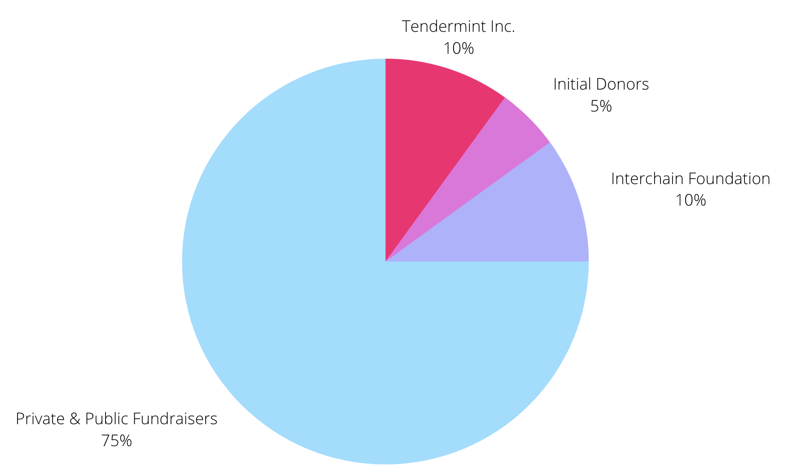
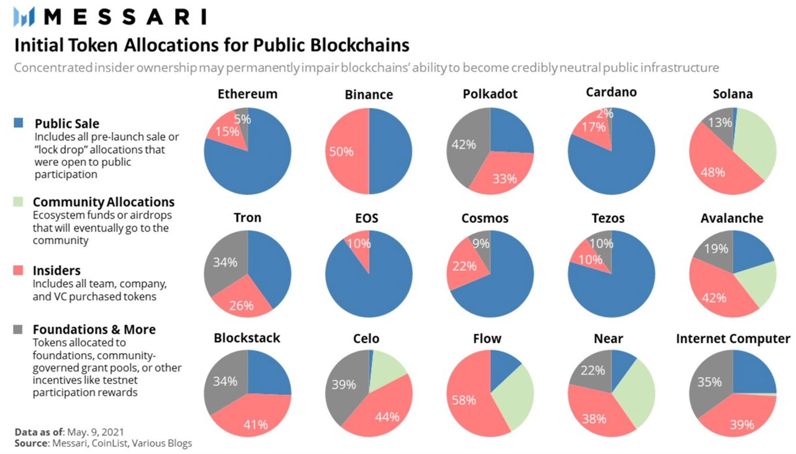

<!-- .slide: data-background-color="#8D3AED" -->

# Economics

---

## Initial ATOM Distribution

---

---

## Cosmos Fundraiser

- Ran in 2017.

- Both ETH and BTC were accepted.

- Hidden cap of 17M.

- Smart contract in Ethereum and miscellaneous tools (cli) audited by OpenZeppelin.

---

## Evolution of token base over time

**ATOM is an inflationary token**

- Initially 7% inflation sent to validators and delegators.

- This inflation rate adjusts itself over time in order to incentivize at least 2/3 of the ATOMs to be bonded.

- As of 21st of July 2022, the percentage of ATOMs bonded is close to 63%, and the inflation rate is close to 12%.

- No fee burning mechanism. They argue this will disincentivize staking.

---

## ATOM Utility

**ATOM tokens can be used for:**

- Staking.

- Governance.

- Transaction fees (use a gas system).

---

## Transaction Fee Volume

---

## Supply and demand

- Supply is driven by the inflation rate.

- Circulating supply is decreased when users stake ATOM.

- Demand is driven by the utility of ATOM.

- As the token is inflationary, the equilibrium price will always decrease unless demand increases.

- Demand could increase based on new projects joining the network (for example Osmosis).

---

## Specialization

- Zones can be application-specific blockchains that are great at doing one thing.

- The hubs and IBC let the different zones to move tokens between them.

- This allows zones to specialize and contribute their services to the network.

- As seen in class, this maximizes the total welfare.

---

## Incentives

- Users of the network are incentivized to stake their ATOM in order to gain block rewards (inflation + fees).
- This works for the benefit of the network because it secures it.
- Validators get a customizable commission from delegators.
- Users of zones are incentivized to demand ATOM in order to bridge to currencies in other zones.
- This keeps the value of the ATOM up, which incentivizes stakers (validators + delegators) to keep staking.
- Dishonest behavior is disincentivized via slashing.
- Hackers are incentivized with bounties to find and expose bugs.

---

## How to become a validator

- Initial validators were the 100 with most delegations before Genesis.
- The validator set size was initially planned to increase 13% every year until 300, 10 years after Genesis.
- This changed, and the size is now determined through governance, it's currently 175.
- Anyone can be a validator, the minimum self bonded amount required is 1 ATOM (~10 USD).
- But to become an active validator, the stake (Self Bonded + Delegated) is at ~40,000 ATOM.
- Delegators are encouraged to distribute their ATOM among different validators to reduce risk of slashing.

---

## Things we like

- Disincentivization of dishonest behavior with slashing. Not only are they losing in opportunity cost. We've seen this (negative) incentive work in many networks.

- The flexible inflation to incentivize 2/3 of the ATOMs to be bonded. This incentivizes validators and delegators to contribute to the common good that is securing the network, but doesn't waste too many rewards.

---

## Things we would like to improve

- The fact that each zone is expected to secure itself. This moves demand from ATOM to the native tokens of the individual zones. An improvement could be a shared security model like Polkadot. Interchain security is expected to launch soon, which will add this shared security model and make the ATOM much more powerful.

- The possibility of the Cosmos Hub becoming less relevant because other zones connect via other hubs. This allows for multiple different tokens to exist for the different hubs and limits the demand for each one. An improvement would be to use the ATOM token on all hubs, therefore making it more relevant.
