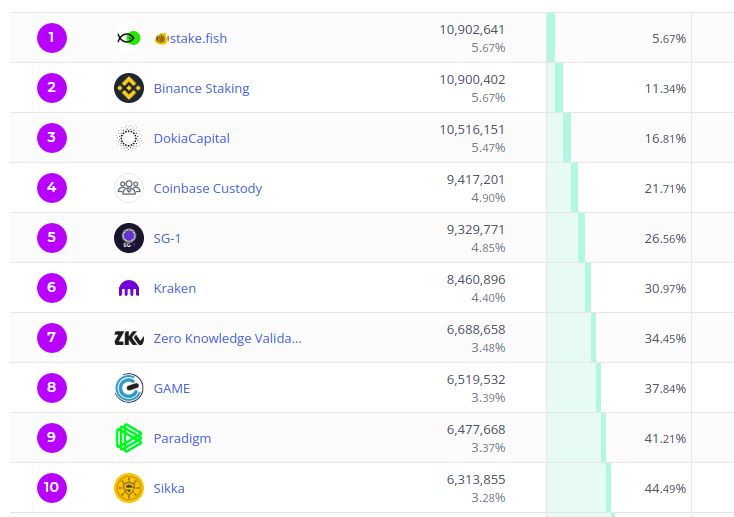

<!-- .slide: data-background-color="#8D3AED" -->

## Governance

<!-- **Goal:** Evaluate the use of governance in this project; name at least two things you like and two things you would want to improve. -->

<!-- - How does this project solve the collective decision making problem? -->

<!-- - What are the structures of governance in this project? How are changes proposed and voted on? -->

<!-- - What voting mechanisms are used in this project? -->

<!-- - Who is allowed to vote in this project? What are the voting criteria? -->

---

## Topics

- Validator Selection
- On-Chain Governance

---

## Proof Of Stake
- Cosmos uses delegated proof of stake consensus mechanism.
- Form of representative Democracy.
- Run a multi-winner election mechanism to elect a set of k validators.
- In this election, the voting power of each voter is proportional to the number of tokens they own (their "stake"), so that if a voter owns 10 tokens, this is equivalent to there being 10 voters with a single token each and with identical ballots.

---

## Proof of Stake
- Tokens are used as protection against a Sybil attack by an adversary.
- A malicious entity may control a large number of validator candidates, but it should be very difficult to get them elected in terms of the numbers of tokens that need to vote for them.
---

## Proof of Stake Goals
- Maximize the total amount at stake.
- Maximize the stake behind the minimally staked validator.
- Minimize the variance of the stake in the set.
---

## Shortcomings (Theory)
- Mechanism they use k-plurality, which is extension of plurality and inherits many of the issues from it.
- Encourages a tactical voting technique known as compromising.
- Voters vote for one or few candidates most likely to win even if that is not their preference. 
- In turn, this leads to very few candidates consolidating more and more vote support over time, in detriment to less popular candidates who perhaps are generally considered to be more competent.
- It becomes a coordination Game!
---

## Don't Trust. Verify.
---
## Putting theory to test

---

## Cosmos vs Polkadot
### Total validators
- Cosmos: 175
- Polkadot: 297  
     

 (As on 21st July, 2022) 

---

## Cosmos vs Polkadot
### Total Stake
- Cosmos: 191,331,986 ATOMS ≈ 2,100,000,000 USD (63%)
- Polkadot: 628,940,586 DOTS ≈ 4,700,000,000 USD (62.8%)
  
     

 (As on 21st July, 2022) 

---

## Cosmos vs Polkadot
### Highest Stake
- Cosmos: 10,902,641 ATOMS ≈ 120,000,000 USD (5.67%)
- Polkadot: 2,000,000 DOTS ≈ 15,000,000 USD (0.32%)
    
     

 (As on 21st July, 2022) 

---

## Cosmos vs Polkadot
### Lowest Stake
- Cosmos: 39,277 ATOMS ≈ 430,000 USD (0.02%)
- Polkadot: 1,850,000 DOTS ≈ 13,870,000 USD (0.29%)
  
     

 (As on 21st July, 2022) 

---

## Cosmos vs Polkadot
- Voting power of Cosmos validators drops to 10x lower than the highest stake for validator#42.
- Lowest stake Cosmos validator has 277 times lower voting power than the highest stake validator. In Polkadot, this difference is just 8%.
- Top 7 validators have more than 34% of voting power.
- Top 22 validators have more than 66% of [voting power](https://www.mintscan.io/cosmos/validators).

---

## Cosmos Validators Cumulative Voting Power

---
## POS Goals (Again)
- ✅ Maximize the total amount at stake. <!-- 63% of ATOM tokens are staked -->
- ❌ Maximize the stake behind the minimally staked validator.
- ❌ Minimize the variance of the stake in the set.
---
## On Chain Proposal and Governance
- Two step process, 14 days deposit period followed by 14 days of voting period.
- Minimum of 64 ATOMS required for a proposal to move from deposit period to voting period. <!-- down from 512 ATOMS-->
- Voting options: `Abstain`, `Yes`, `No`, `NoWithVeto`.
- Deposit Burned if 33.4% or more participating voting power votes for `NoWithVeto`.
- Change network parameters, use community pool and even software upgrades. <!-- through splitting the upgrade into signal and switch-->

---

## For a proposal to pass
- 64 ATOMS need to be deposited.
- 40% of network voting power needs to participate.
- Simple Majority (>50%) for `Yes` is needed for a proposal to pass.
- Deposit burned if quorum is not reached.

---

## Who can Vote?
- Validators in the active set at end of voting period.
- Delegators staking on validators in the active set at the end of voting period.
- If delegators don't vote, the corresponding validators inherit their voting power.
---
## Concerns
- Few of the biggest validators (centralised exchanges like binance, kraken) never participate in voting.
- No Fast track governance. All proposals are treated in the same bucket.
- Deposit burning when quorum is not reached discourage genuine users from proposing. 
<!-- https://hub.cosmos.network/main/governance/process.html -->
- No incentive for voting power to participate in proposals.
- Not every ATOM holder can vote.
- 74 proposals in last 39 months.
---

## Things we like
- Having on-chain governance and a community pool.
- Weighted votes feature which allows stakers to split their votes into several voting options.
- Having a deposit burning mechanism to prevent spam.

---
## Things we would improve
- Improve validator selection mechanism so that voting power is more uniformly spread. Today, top 7 validators can collude and attack the network.
- Encourage more genuine proposals and more use of community pool.
- Add different tiers of governance proposal that require different timeline based on risk assessment.

<!-- ## Notes -->

<!-- > Governance -->
<!-- - 64 atoms deposit -->
<!-- - anyone can deposit -->
<!-- - Options: Abstain, Yes, No, NoWithVeto -->
<!-- - Minimum voting power 40% required -->
<!-- - if 33.4% Veto, deposit is burned -->
<!-- - fixed 14 day voting period -->
<!-- - Only validators and delegators in active set has voting power -->
<!-- - Total validators 175 -->
