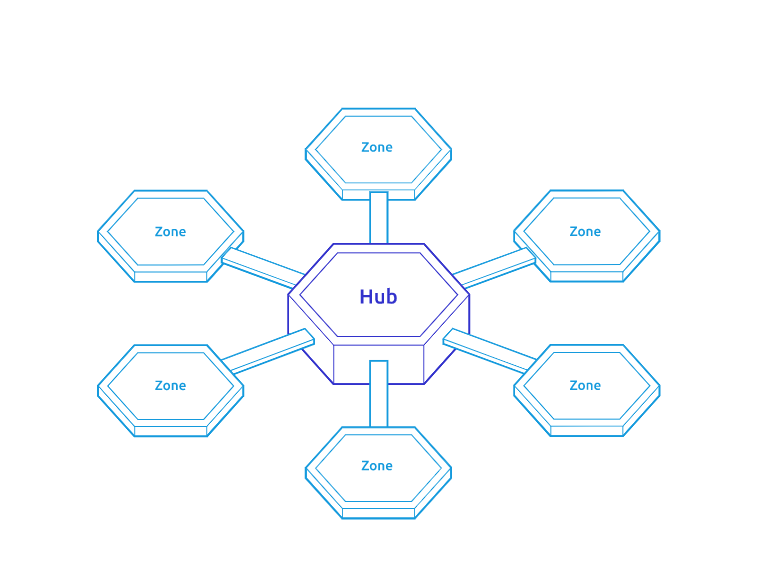

<!-- .slide: data-background-color="#8D3AED" -->

# Cosmos

---

## Team members

- Alejandro

- Ankan

- Dadepo

- Francisco

- Sofiane

---

## What is Cosmos?

- Ecosystem of independent interconnected blockchains.

- Blockchains communicate to each other via IBC (Inter-Blockchain Communication) protocol.

- Cosmos provides a SDK to build your own application specific chain and connect it to the network.

---
## Cosmos Network

- Hub and Zones Architecture

- Zones are the regular heterogeneous blockchains.

- Hubs are designed blockchains to connect the Zones.

---
## Cosmos Network

---
## Cosmos Hub

- The first hub on the network is the Cosmos Hub.

- It is a proof of stake blockchain whose native staking token is ATOM.

- From now on, when we say Cosmos, what we mean is Cosmos Hub.
---

## Cosmos SDK

- Open Source Framework for building multi-asset PoS blockchains

- Written in Go

- Apache License 2.0

---

## IBC Protocol

- General-purpose message passing protocol

- Can be used for Interchain Accounts and Interchain Security

- Can be setup using a Cosmos SDK Module
