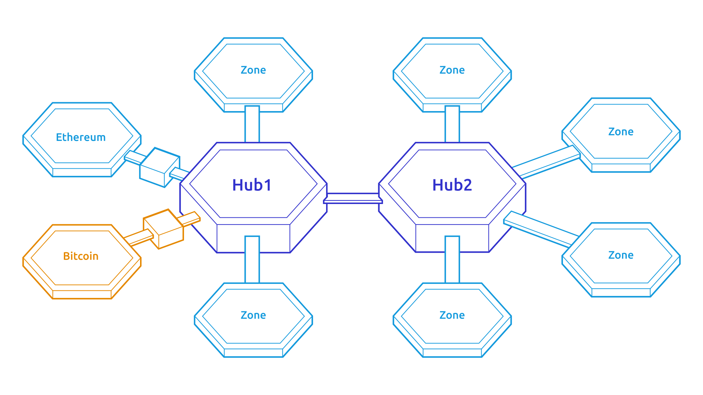
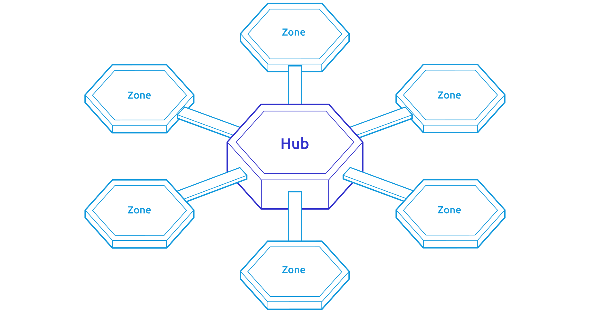
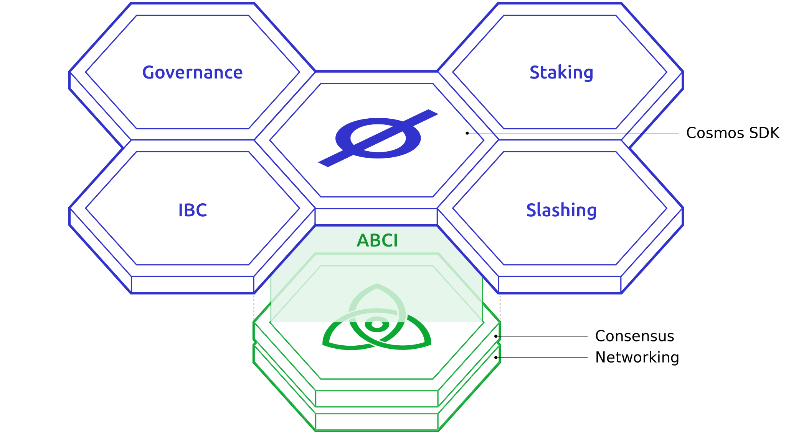
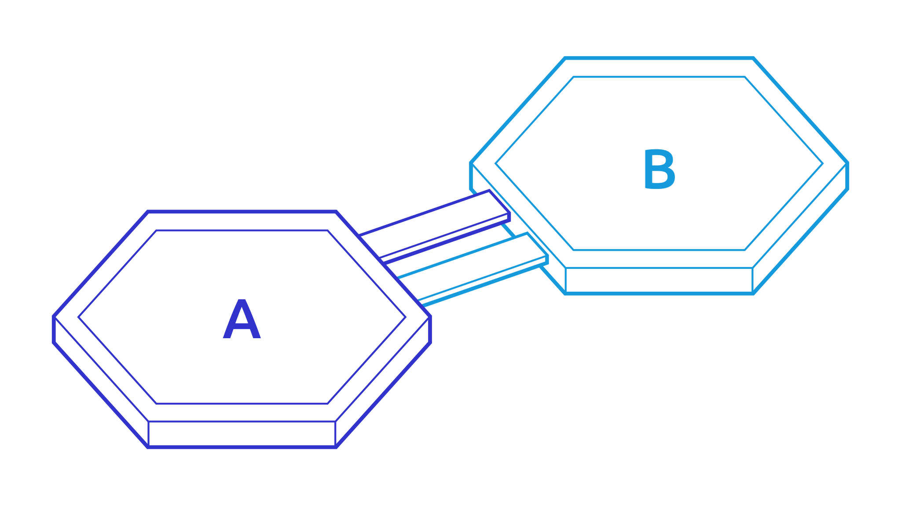

<!-- .slide: data-background-color="#8D3AED" -->

# Cosmos

### _The Internet of Blockchains._

---

## Team members

- Alejandro

- Ankan

- Dadepo

- Francisco

- Sofiane

---

## What is Cosmos?

- Ecosystem of networks and tools for creating self-sovereign interconnected blockchains.

- Blockchains can be built using the Cosmos SDK.

- Different blockchains can communicate with each other via IBC (Inter-Blockchain Communication protocol).

---

## Cosmos Network

<ul>
    <li>Hub and Zones architecture.</li>
    <li>Zones are regular heterogeneous blockchains.</li>
    <li>Hubs are blockchains designed to connect Zones.</li>
</ul>

---

## Cosmos Hub - Gaia

    <ul>
        <li>The main Hub on the Cosmos network.</li>
        <li>Built with the Cosmos SDK.</li>
        <li>The primary token is the ATOM.</li>
        <li>Cosmos and Cosmos Hub will be used interchangeably in this presentation.</li>
    </ul>
    

---

## Cosmos SDK

    <ul>
        <li>Open Source Framework for building multi-asset PoS blockchains</li>
        <li>Written in Go</li>
        <li>Apache License 2.0</li>
    </ul>
    

---

## IBC

    <ul>
        <li>General-purpose message passing protocol.</li>
        <li>Can be used for Interchain Accounts and Interchain Security.</li>
        <li>Can be setup using a Cosmos SDK Module.</li>
    </ul>
    

